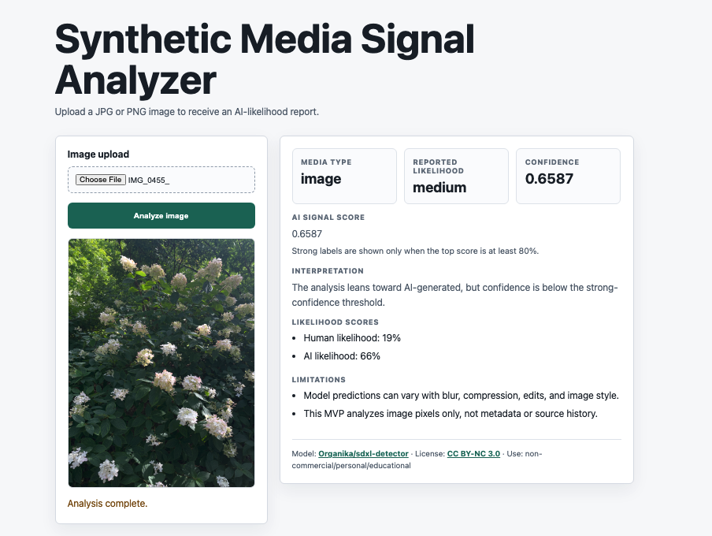

# Synthetic Media Signal Analyzer

A local FastAPI app that estimates AI-generated image likelihood using a pretrained image-classification model.

## Features

- Accepts JPG, JPEG, and PNG uploads.
- Includes a simple browser UI.
- Runs image analysis locally.
- Returns reported likelihood, confidence, AI signal score, and interpretation.

## Demo



## Setup

Use Python 3.10, 3.11, or 3.12.

```bash
python -m venv .venv
source .venv/bin/activate
pip install -r requirements.txt -r requirements-ml.txt
```

## Run

From the project root:

```bash
source .venv/bin/activate
python -m uvicorn main:app --reload
```

Open `http://127.0.0.1:8000` and upload a JPG, JPEG, or PNG image.

## Model

- Default model: [`Organika/sdxl-detector`](https://huggingface.co/Organika/sdxl-detector)
- The default model is licensed separately by its authors under CC BY-NC 3.0 for non-commercial use.
- Model weights are downloaded from Hugging Face at runtime and are not included in this repository.

## Limitations

This project implements an image-analysis workflow and is not intended as a production-grade detector. Results are model-based signals and may vary across different image types.
